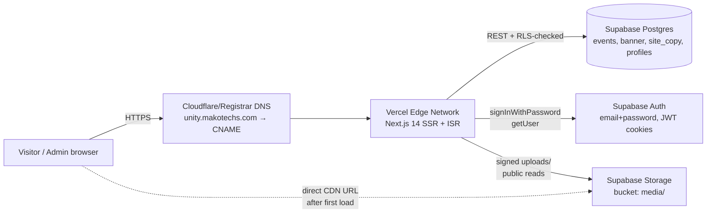
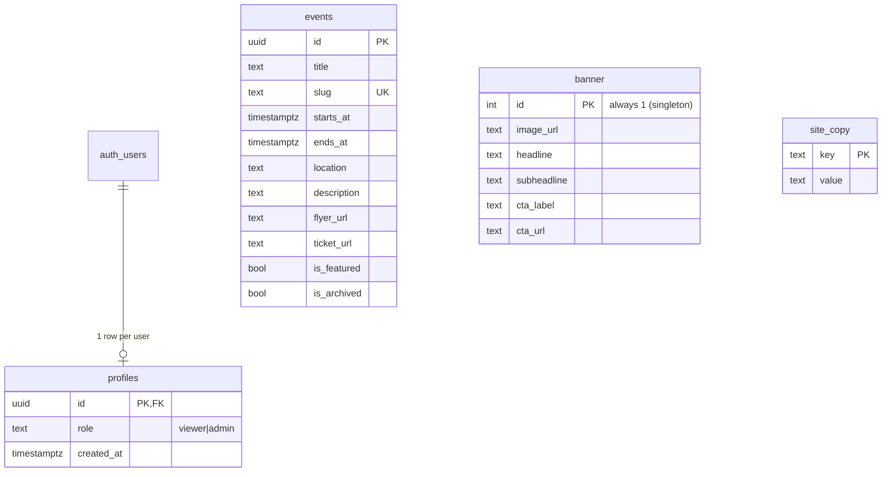
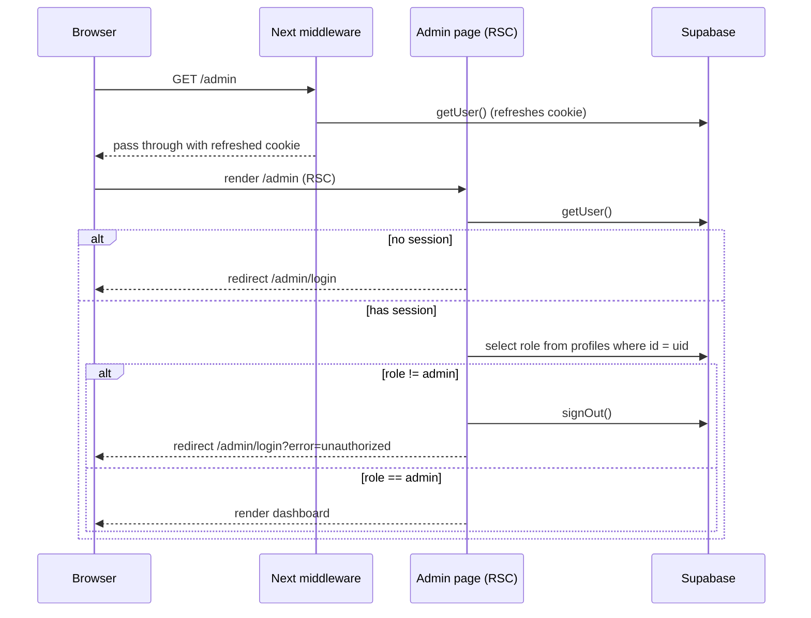
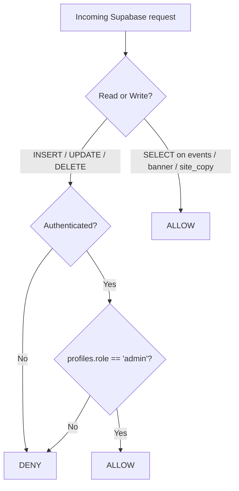

# Unity n Music 517 — Engineering Reference

> Canonical readme. Renders on GitHub via Mermaid for the diagrams.
> Brief: `README.md` · Deploy walkthrough: `DEPLOY.md` · Design rationale: `DESIGN.md` · Mistakes-log: `LESSONS_LEARNED.md`.

A mobile-first event site for the Unity n Music 517 collective (Lansing, MI), built so a non-developer admin can run the whole site from a single sign-in.

---

## 1. What it does

| Surface | Capability |
| --- | --- |
| **Public homepage** | Hero banner (admin-swappable), one featured event (poster + details), responsive grid of upcoming events (1 col mobile → 9 col desktop), about/footer. |
| **Public event detail** | `/events/[slug]` — flyer, date in local time, location, description, optional ticket link. |
| **About** | `/about` — admin-editable copy blocks. |
| **Admin (hidden)** | `/admin/*` — no public links. Sign in → CRUD events, swap banner image + headline, edit site copy blocks. |
| **Storage** | Supabase Storage bucket `media/` holds flyer + banner uploads. RLS-gated so only admins can write. |
| **Auth** | Supabase email + password. Role check via `profiles.role = 'admin'`. New signups default to `viewer`. |

---

## 2. Quick start (local)

```bash
# 1. Install deps
npm install

# 2. Configure Supabase
cp .env.local.example .env.local
# Fill NEXT_PUBLIC_SUPABASE_URL and NEXT_PUBLIC_SUPABASE_ANON_KEY from
# Supabase → Settings → API.

# 3. Run the SQL migrations once
# In Supabase dashboard → SQL editor, paste & run:
#   - supabase/migrations/001_init.sql
#   - supabase/migrations/002_seed_unity_fest.sql

# 4. Create an admin user
# Supabase → Authentication → Add user (email/password)
# Then in SQL editor:
#   update public.profiles set role = 'admin'
#     where id = (select id from auth.users where email = 'YOU@example.com');

# 5. Dev
npm run dev
# Public: http://localhost:3000
# Admin:  http://localhost:3000/admin  (sign in with the account above)
```

For production deploy to `unity.makotechs.com`, see `DEPLOY.md`.

---

## 3. Stack & versioning

```
Next.js 14 (App Router, RSC, Server Actions) ─ TypeScript ─ Tailwind 3
@supabase/ssr 0.5+ for cookie-aware auth on edge + server
Supabase: Postgres + Auth + Storage (single project)
Hosting: Vercel (Hobby tier covers this volume)
Node: 18+ (Vercel uses 20 by default)
```

Why these — see `DESIGN.md §3`.

---

## 4. System architecture

### 4.1 Deployment topology



The browser only ever talks to Vercel for HTML/JSON. Image URLs returned from Supabase Storage are loaded direct from Supabase's CDN — this saves Vercel egress on flyer images.

### 4.2 App Router file map

```
src/
  middleware.ts                   # Refreshes Supabase session on every request
  app/
    layout.tsx                    # Root layout, fonts, footer
    globals.css                   # Theme tokens (CSS vars)
    page.tsx                      # Public home
    about/page.tsx                # Public about
    events/[slug]/page.tsx        # Public event detail
    admin/
      layout.tsx                  # Admin chrome (header + nav)
      page.tsx                    # Dashboard (gated)
      login/page.tsx              # Sign in (server action)
      logout/route.ts             # POST → signOut → redirect
      actions.ts                  # Server actions: CRUD + uploads
      events/
        page.tsx                  # List + delete
        new/page.tsx              # Create form
        [id]/page.tsx             # Edit form
        EventForm.tsx             # Shared create/edit form
      banner/page.tsx             # Hero banner editor
      copy/page.tsx               # Site copy editor
  components/                     # Hero, FeaturedEvent, EventCard, EventGrid, SiteFooter, ui/
  lib/
    supabase/{client,server,middleware}.ts
    auth.ts                       # requireAdmin / getOptionalAdmin guards
    queries.ts                    # Public read helpers (repository pattern)
    format.ts                     # Local-time date formatter
    types.ts                      # Mirrors the SQL schema
supabase/
  migrations/
    001_init.sql                  # Schema + RLS + storage bucket
    002_seed_unity_fest.sql       # Seeds the launch event
```

### 4.3 Data model



`banner` is a singleton table — exactly one row, id = 1. Cheaper than versioning; the admin only ever needs the current hero. See `DESIGN.md §4.2`.

### 4.4 Auth + authorization flow



Two layers of defense:

1. **App-layer guard** (`requireAdmin()` in `src/lib/auth.ts`) — every admin page + server action calls it first. Renders the redirect at the React boundary.
2. **Row-Level Security in Postgres** — even if the app-layer guard were bypassed, the RLS policies on `events`/`banner`/`site_copy`/`storage.objects` require `public.is_admin()` to return true for any write. The anon key cannot mutate anything. See `supabase/migrations/001_init.sql`.

### 4.5 RLS decision matrix



---

## 5. Design patterns in use

Documented in detail in `DESIGN.md §6`. Quick index:

| Pattern | Where | Why |
| --- | --- | --- |
| **Repository** | `src/lib/queries.ts` | Single place that knows how to read each table; pages stay declarative. |
| **Guard** | `src/lib/auth.ts` (`requireAdmin`) | Co-located auth check that throws-via-redirect; pages can't forget it. |
| **Server Actions** | `src/app/admin/actions.ts` | Mutations live next to the admin UI; no separate API layer to maintain. |
| **Theme Tokens** | `globals.css` CSS variables + Tailwind brand colors | Re-brand without code changes. |
| **Singleton row** | `banner` table | One hero at a time; simpler than versioning. |
| **Compositional UI primitives** | `src/components/ui/*` | Button, FormField shared across admin forms. |

---

## 6. Mobile-first responsive system

The event grid scales:

| Breakpoint | Columns | Rationale |
| --- | --- | --- |
| `< 640px` (mobile) | 1 | Thumb-first single column, 3:4 aspect. |
| `sm 640–768` | 2 | Phablet / small tablet. |
| `md 768–1024` | 3 | Tablet. |
| `lg 1024–1280` | 4 | Laptop. |
| `xl 1280–1536` | 6 | Desktop. |
| `2xl 1536+` | **9** | Wide-desktop info density per user spec. |

Card aspect ratio is fixed at 3:4 so flyer art doesn't crop unpredictably across breakpoints.

---

## 7. Running the project against a fresh database

If you're starting over with a clean Supabase project:

1. Run `001_init.sql` then `002_seed_unity_fest.sql` in the SQL editor.
2. Add the env vars to `.env.local` (or Vercel).
3. Create one admin via the Supabase Auth dashboard + the role-promote SQL in §2.

Everything else — banner, copy, additional events — is admin-managed at runtime.

---

## 8. Where to look for…

- **"Why this color / font / layout?"** → `DESIGN.md`
- **"What mistakes were made along the way?"** → `LESSONS_LEARNED.md` (kept current automatically; do not delete)
- **"How do I ship this to production?"** → `DEPLOY.md`
- **"How do I add a new admin capability?"** → Add a server action in `src/app/admin/actions.ts`, page in `src/app/admin/<feature>/page.tsx`, RLS policy in a new migration.

---

## 9. License + ownership

Built by [makotechs.com](https://makotechs.com) for Unity n Music 517 (@unitynmusic517). All event content + brand assets © Unity n Music 517.
