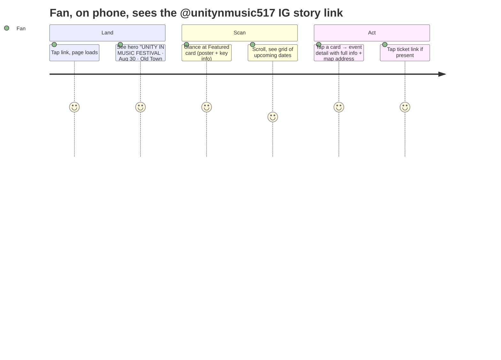
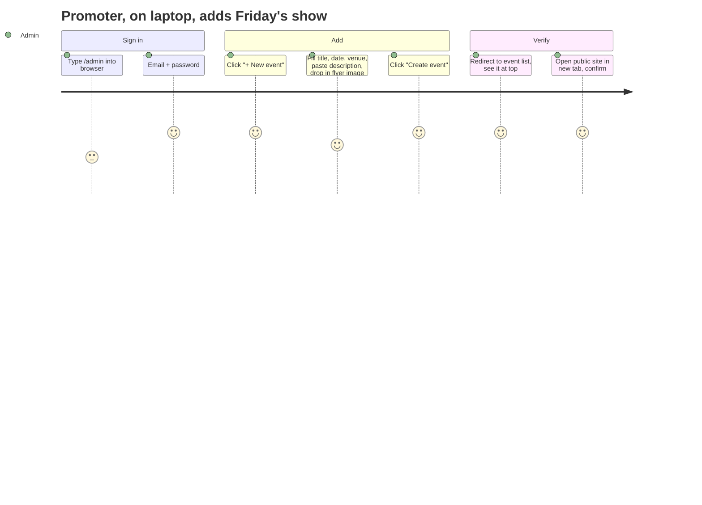

# Design Rationale — Unity n Music 517

> Written from the head-of-design seat: every meaningful choice gets a *why*. Read this if you're auditing the work, replacing the designer, or about to argue with the typography. Engineering patterns are documented too — design and code rationale belong in the same room.

---

## 1. Lens

**Who this site is for:** local fans, scene regulars, walk-up curious. Mostly on phones, mostly at night, mostly already inside the scene. They're not here to be educated — they're here to find out *what's happening, when, and how to get in.*

**Who they're not:** corporate clients, suburban grandparents, people who want a venue Wikipedia page. We design *toward* the user we have, not away from one we don't.

**Two governing references:**

1. **Steve Krug — *Don't Make Me Think*.** Pages should be self-evident. Visual hierarchy carries meaning. Conventions are friends. Words matter, scan-ability matters more.
2. **The user's 9-step framework** (latest version, used here):

   | # | Stage | What it produces |
   |---|---|---|
   | 1 | **Discovery** | Goals, ICP, competitors, **keyword intent**. |
   | 2 | **Architecture** | Sitemap + URL structure, **SEO-first**. |
   | 3 | **Wireframe** | UX flows + **conversion points** marked. |
   | 4 | **Design** | Clean UI, mobile-first. |
   | 5 | **Build** | Fast, scalable, **Core Web Vitals** hard requirement. |
   | 6 | **SEO setup** | On-page meta, **schema.org**, **internal linking**. |
   | 7 | **QA** | Tech checks, tracking, **cross-device**. |
   | 8 | **Launch** | **GSC + GA4** verified, indexing requested. |
   | 9 | **Iterate** | Data-driven **CRO** + content + links. |

   The rule: *strategy first, SEO baked-in, then let data drive iterations.* SEO is not a v2 line item — it's step 6 of 9 and a launch prerequisite.

The brand reference (sectionlive.com — The Intersection in Grand Rapids) is correct gravity for the genre: dark, image-led, the show is the headline.

---

## 2. Success metrics for v1

Defined *before* the build, per the user's process:

| Goal | How we'll know |
| --- | --- |
| Visitors know what the next event is in < 5s | Featured event is above the fold on mobile; date is in the first line of subhead. |
| Admin can publish a new event in < 2 minutes | Single form, file upload + URL fallback, "Save" is the only primary button. |
| Old events disappear automatically | `is_archived` filter + `starts_at` < now hides them; no admin chore. |
| Site loads fast on a cold 4G phone | Images served by Supabase CDN, fonts via `next/font` with `swap`, no client-side JS for the public read path. |
| Admin URL is undiscoverable to casual users | No public links to `/admin`; `robots.txt` disallows; per-page `noindex`. |

"Lead form / demo booking" style conversion metrics don't apply here — this is a discovery + show-up site. Replace these with conversion metrics if a v2 adds ticketing or RSVPs.

### Conversion points marked in the wireframes

Per the framework's step 3, each wireframe answers *what is the user trying to do here, and how do we measure it?*

| Page | User goal | Conversion event |
| --- | --- | --- |
| Home | Find the next show | `hero_cta_click` (CTA pill) or `event_card_click` |
| Event detail | Decide to attend / buy ticket | `ticket_outbound_click` (most important) |
| About | Learn who runs the org | `instagram_outbound_click` |
| Admin | Add/update events | session-level; not user-conversion |

These names map cleanly to GA4 custom events. See §11 for the launch checklist.

---

## 3. Discovery summary

| Question | Answer that drove a decision |
| --- | --- |
| **Who runs the org?** | Unity n Music 517 (Lansing MI, 517 area). Promoter ties: Evolve Studios, GG. |
| **What's the flagship show?** | Unity in Music Festival — Aug 30, 216 E Grand River Ave, Old Town Lansing, free, all ages, 11am–10pm. Already seeds the homepage. |
| **What does the brand look like today?** | Two flyers in `raw/`: dark backgrounds, neon pink/magenta + cyan glow, bold geometric display type, disco-ball iconography. Underground EDM aesthetic. |
| **Who edits the site?** | One person — the promoter. Probably on a phone half the time. |
| **What's not on the site?** | Merch, ticketing, RSVP, blog. v1 is event listings + hero. Out of scope by design. |
| **Domain story?** | `unity.makotechs.com` (makotechs.com is the user's umbrella; Unity gets a subdomain). |

---

## 4. Sitemap + user flows

### 4.1 Sitemap

```mermaid
graph TD
  H[/ Home/]:::pub
  E[/events/[slug] Event detail/]:::pub
  A[/about About + contact/]:::pub
  AL[/admin/login Hidden sign-in/]:::admin
  AD[/admin Dashboard/]:::admin
  AE[/admin/events Event list/]:::admin
  AN[/admin/events/new New event/]:::admin
  AED[/admin/events/[id] Edit event/]:::admin
  AB[/admin/banner Banner editor/]:::admin
  AC[/admin/copy Site copy editor/]:::admin

  H --> E
  H --> A
  AL --> AD
  AD --> AE
  AD --> AB
  AD --> AC
  AE --> AN
  AE --> AED

  classDef pub fill:#0b1020,stroke:#ff1a75,color:#fff
  classDef admin fill:#0b1020,stroke:#22d3ee,color:#fff
```

Public surface = three URLs. That's the entire scannable mental model for a visitor. Admin is a parallel, hidden universe accessed by URL only.

### 4.2 Primary user flow — fan finding a show



This is one tap, two scrolls, one tap. Krug-clean.

### 4.3 Admin flow — promoter adds a show



Five fields, one upload, one button. The optimization target is "would a non-developer do this on their phone?" Yes.

---

## 5. Wireframes (low-fi)

I deliberately wireframe before pixel design. These would be sketches on paper in a real engagement; ASCII serves here.

### 5.1 Mobile home (`< 640px`)

```
┌────────────────────────────┐
│  ░░░ flyer behind 40% ░░░  │   ← Hero: image bg, dark gradient,
│  [• FEATURED · NOW]        │     bold display headline, subhead,
│                            │     CTA "See the lineup →"
│  UNITY IN MUSIC            │
│  FESTIVAL                  │
│  Aug 30 · Lansing · Free   │
│  [ See the lineup → ]      │
├────────────────────────────┤
│  HEADLINING                │   ← Featured event card
│  ┌────────┐                │     Big flyer image on top
│  │ flyer  │                │     Title + date + place + CTA
│  └────────┘                │
│  AUG 30 · 11am–10pm        │
│  Unity in Music Festival   │
│  216 E Grand River Ave...  │
│  Details →                 │
├────────────────────────────┤
│  UPCOMING            5 shows│   ← 1-col grid
│  ┌──────────────────────┐  │
│  │ flyer (3:4)          │  │
│  ├──────────────────────┤  │
│  │ Aug 30               │  │
│  │ Unity Fest           │  │
│  └──────────────────────┘  │
│  ┌──────────────────────┐  │
│  │ ...                  │  │
│  └──────────────────────┘  │
├────────────────────────────┤
│  UNITY N MUSIC 517 · About │   ← Footer
│  IG: @unitynmusic517       │
└────────────────────────────┘
```

### 5.2 Desktop home (`≥ 1536px`)

```
┌──────────────────────────────────────────────────────────────────────────┐
│  HERO — full-bleed flyer wash, headline up to 8xl, CTA pill              │
├──────────────────────────────────────────────────────────────────────────┤
│  HEADLINING                                                              │
│  ┌────────────────┬────────────────────────────────────────────────────┐ │
│  │ Flyer (4:5)    │ AUG 30 · 11am–10pm                                 │ │
│  │                │ Unity in Music Festival                            │ │
│  │                │ 216 E Grand River Ave, Old Town Lansing            │ │
│  │                │ All ages, free, multiple stages, DJs ...           │ │
│  │                │ Details →                                          │ │
│  └────────────────┴────────────────────────────────────────────────────┘ │
├──────────────────────────────────────────────────────────────────────────┤
│  UPCOMING                                                       8 shows  │
│  ┌──┬──┬──┬──┬──┬──┬──┬──┬──┐                                            │
│  │  │  │  │  │  │  │  │  │  │   ← 9 cards across at 2xl                  │
│  └──┴──┴──┴──┴──┴──┴──┴──┴──┘                                            │
└──────────────────────────────────────────────────────────────────────────┘
```

The 9-wide grid is dense on purpose — power-users on a wide monitor get the full season at a glance. Per Krug, *scanning* is the dominant reading mode; dense thumbnails serve that better than verbose cards.

### 5.3 Admin event form

```
┌─────────────────────────────────────┐
│  Title           [_______________]  │
│  Slug (auto)     [_______________]  │
│  Starts at       [datetime-local]   │
│  Ends at         [datetime-local]   │
│  Location        [_______________]  │
│  Description     [               ]  │
│                  [               ]  │
│  Ticket URL      [_______________]  │
│  Flyer:          [📎 Choose file]   │
│                  or URL [________]  │
│  ☐ Feature on homepage              │
│  ☐ Archived (only on edit)          │
│                                     │
│        [ Create event ]             │
└─────────────────────────────────────┘
```

One primary action, one column, top-to-bottom reading order. No "tabs," no "advanced," no "save draft" — this is a 5-field form for a busy promoter.

---

## 6. Visual design system

### 6.1 Color

| Token | Value | Use | Rationale |
| --- | --- | --- | --- |
| `--brand-ink` | `rgb(8 8 14)` | Page background | Near-black, slightly blue — reads as "venue at night," not as "code editor dark mode." |
| `--brand-paper` | `rgb(245 245 250)` | Body text | Off-white. Pure white on near-black is harsh at any duration. |
| `--brand-card` | `rgb(18 18 28)` | Raised surfaces | One step up from ink for depth without borders. |
| `--brand-line` | `rgb(38 38 54)` | Hairline borders | Visible but not loud. |
| `--brand-muted` | `rgb(140 140 160)` | Secondary text, dates in lists | Hierarchy via tone, not size. |
| `--brand-neon` | `rgb(255 26 117)` | Primary accent, CTA, "Featured" badge | Pulled directly from the Unity Fest flyer's magenta. The brand's *most owned* color. |
| `--brand-cyan` | `rgb(34 211 238)` | Secondary accent, "headlining" eyebrow, ticket CTA | Complements neon-pink for the disco-ball glow effect. |
| `--brand-violet` | `rgb(167 85 255)` | Tertiary, background washes | Bridges pink and cyan — used sparingly so it stays special. |

All tokens are exposed as CSS variables in `globals.css` and consumed via Tailwind's `brand-*` namespace. **The admin can rebrand by editing one file** — no component-level color rewriting required.

### 6.2 Type

| Role | Family | Why |
| --- | --- | --- |
| **Display** | Bebas Neue (Google) | Tall, narrow, geometric. Mirrors the flyer's headline type. Reads as "show poster." |
| **Body** | Inter (Google) | Variable-width neo-grotesque, optimized for screens at any size. Quiet so the display type and the flyers can shout. |
| Fallback | system-ui | Bebas Neue is 9KB woff2 — loaded with `display: swap` so we never block paint. |

Loaded via `next/font/google` for automatic self-hosting + zero layout shift.

### 6.3 Motion

Restrained on purpose:

- `hover:scale-105` on card images at the public level — slow (300ms), subtle, indicates clickability without dancing.
- `shadow-glow-neon` / `shadow-glow-cyan` on primary CTAs — static glow, not animated, so the page doesn't feel like a rave at rest. The site evokes the rave; it isn't the rave.

No scroll-jacking, no parallax. Krug: *don't make me think about the navigation.*

### 6.4 Voice

- Words are short and concrete: "Headlining," "Upcoming," "Details →," "+ New event."
- Dates always in local Eastern Time, formatted as `Aug 30 · 11am–10pm`. The user's question "when?" is answered in one glance, no math.
- Admin labels are imperatives ("Save changes," "Create event") because admins are doing things, not browsing.

---

## 7. Information architecture — what's where and why

| Decision | Why |
| --- | --- |
| **Featured event lives separately from the grid** | One event always carries the page. Putting it in the grid would force scanning. |
| **Newest-first sort on the grid** | The user's spec. Also matches mental model: "what's next?" Past events drop off automatically. |
| **3:4 card aspect ratio** | Matches the natural orientation of show flyers. Square crops bisect typography; portrait preserves it. |
| **Single-row admin nav, top-fixed** | Sticky chrome so the admin never loses orientation while editing. |
| **No public link to `/admin`** | Security through layering, not obscurity: this is the *first* layer (you can't click a link that doesn't exist). The *real* security is RLS in Postgres + the `requireAdmin` guard. Hiding the link reduces curious probing, not actual attacks. |

---

## 8. Krug audit

Krug's principles, checked against the build:

| Principle | Status | Evidence |
| --- | --- | --- |
| **Don't make me think** | ✅ | Three public URLs. Hero answers "what & when" in two lines. |
| **Strong visual hierarchy** | ✅ | Display type at 5xl–8xl; body at 1rem; muted at `text-brand-muted`. Featured > grid > footer, in that visual weight order. |
| **Conventions are friends** | ✅ | Hero, featured, grid, footer — the universal music-venue layout. We don't reinvent it. |
| **Clearly defined areas** | ✅ | Hero, "Headlining," "Upcoming," footer each have generous vertical space + an eyebrow label. |
| **Obvious what's clickable** | ✅ | Cards have hover lift + border accent; CTAs are filled pills with glow; nav text changes color on hover. |
| **Minimize noise** | ✅ | No carousels, no popups, no live tickers, no chat widget, no cookie banner (we don't track). |
| **Words matter** | ✅ | "Headlining" beats "Featured Event." "Get tickets →" beats "Click here for ticketing information." |

The one area to revisit at v2: scannable per-event metadata. Today cards show date + title + venue. Once there are 30+ events, we'll need a filter row (date range, genre) — but adding it now would violate "don't make me think" for the 5-event case. Defer.

---

## 9. Engineering patterns (and why)

The principal-engineer view of the codebase. Each pattern is in service of either *fewer chances to forget security* or *simpler change in the future*.

| Pattern | Where | What it buys us |
| --- | --- | --- |
| **Repository (read-only helpers)** | `src/lib/queries.ts` | Pages stay declarative; all SQL/filter logic is in one file. Adding a new sort or filter touches one function, not five pages. |
| **Guard** | `src/lib/auth.ts` — `requireAdmin()` | Every admin page calls it as the first line. Auth check can't be forgotten if forgetting it means the page won't render. |
| **Server Actions over REST** | `src/app/admin/actions.ts` | Mutations are co-located with the UI that calls them. No `/api/admin/events/[id]/update.ts` route file. Less ceremony, fewer JSON contracts to keep in sync. |
| **Defense in depth** | App guard + Postgres RLS | Even if the app guard is bypassed, RLS in `001_init.sql` refuses non-admin writes. App layer is convenience; DB layer is truth. |
| **Singleton table for banner** | `banner` PK = `1` | One hero at a time is the actual product behavior. Modeling a singleton as a 1-row table is simpler than a versioned table with "current" semantics. |
| **Theme tokens (CSS vars + Tailwind brand colors)** | `globals.css` + `tailwind.config.ts` | Rebrand without component edits. |
| **Compositional UI primitives** | `src/components/ui/Button.tsx`, `FormField.tsx` | Shared between admin pages so they age coherently. |
| **Slug + datetime-local for admin inputs** | `EventForm.tsx` | Native browser controls beat custom date pickers for accessibility and bundle size. |

### 9.1 Where I deliberately *didn't* over-engineer

- **No state management library.** RSC + server actions cover every mutation; nothing on the client needs Zustand/Redux.
- **No tRPC.** Server Actions give us typed mutations; tRPC would be a parallel layer for the same job.
- **No CMS.** Supabase + the admin UI *is* the CMS. Adding a third-party CMS would split the source of truth.
- **No image transformation pipeline.** Supabase Storage serves the raw upload + Next/Image handles responsive sizing. If the bill spikes, revisit.

---

## 10. SEO + analytics: what ships in v1 (not v2)

Per the framework, SEO is **built-in**, not bolted on. Concretely shipping in this v1:

| Step (framework) | Shipped artifact | File |
| --- | --- | --- |
| 2 — Architecture / URL structure | Human-readable slugs (`/events/unity-fest-2026`). No query-string IDs. | `app/events/[slug]/page.tsx` |
| 6 — On-page meta | Per-event `generateMetadata` → unique `<title>`, description, OG image. | `app/events/[slug]/page.tsx` |
| 6 — schema.org | `Event` JSON-LD on detail page; `MusicGroup` JSON-LD on home. | same + `app/page.tsx` |
| 6 — Sitemap | Generated from DB, regenerated per request so new events appear. | `app/sitemap.ts` |
| 6 — robots | Static `public/robots.txt` disallows `/admin`, points at sitemap. | `public/robots.txt` |
| 6 — Internal linking | Footer links to About; back-link on every event detail; CTA in hero anchors to grid. | layout + components |
| 5 — Core Web Vitals | `next/image` for all flyers; `next/font` w/ `swap`; RSC for public pages (zero client JS). | infra-level |

### Pending at *launch time* (step 8 — not v2)

These don't go in the repo but must be done before flipping DNS:

- Verify domain ownership in **Google Search Console** (DNS TXT record).
- Submit `https://unity.makotechs.com/sitemap.xml` to GSC.
- Add **GA4** property; set up the four conversion events from §2 (`hero_cta_click`, `event_card_click`, `ticket_outbound_click`, `instagram_outbound_click`).
- Page-speed pass on PageSpeed Insights; target LCP < 2.5s, CLS < 0.1, INP < 200ms on mobile.

See `DEPLOY.md` (to be extended) for the operational steps.

## 11. v2 backlog (genuinely deferred)

These are out of scope for v1 by design, not by oversight:

- [ ] **RSVP / ticketing.** Adds an `attendees` table + admin "Guest list" view.
- [ ] **Filter row on the grid** once event count > ~20.
- [ ] **Brand color picker in admin** writes to a `theme` table and overrides CSS vars at runtime.
- [ ] **Magic-link auth** for promoters who hate passwords. Supabase already supports it.
- [ ] **Newsletter capture** in the footer once an audience exists.

---

## 12. How design decisions get changed

If you disagree with any choice in this doc:

1. Note which §section + which decision.
2. State the user impact you expect.
3. Propose the swap.
4. Append the decision to this file (under §10 or as a new section) with the date and the reasoning.

Design decisions are durable when they're documented; they're brittle when they're tribal knowledge. Keep this file alive.
